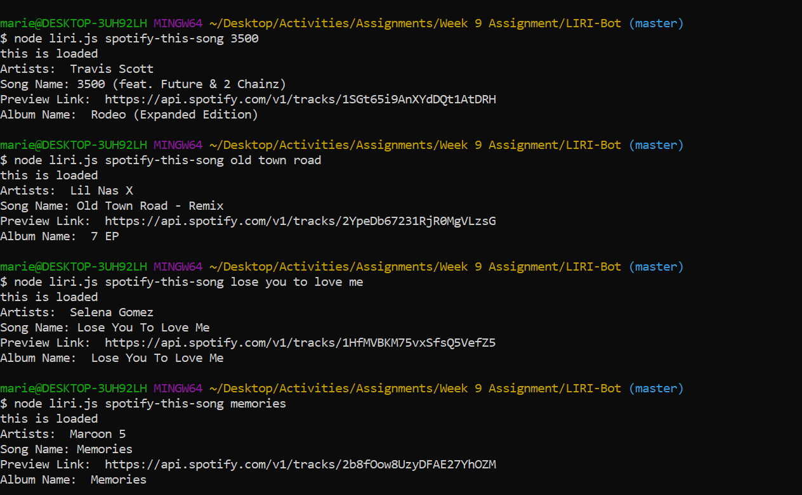
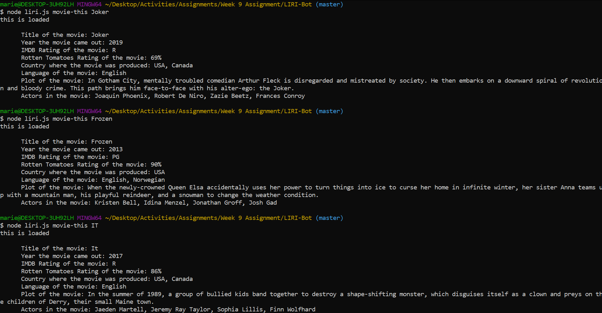
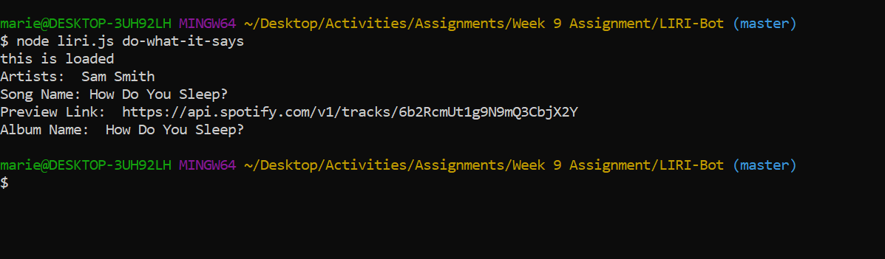

# LIRI-Bot
LIRI Bot is like iPhone's SIRI, but instead is a Language Interpretation and Recognition Interface. 

### Overview ###
--------------------------
LIRI is a command line node app that takes in parameters and gives you back data based off the following parameters:
 * spotify-this-song
 * movie-this
 * concert-this
 * do-what-it-says

### Files Needed: ###
•	package.json
•	.gitignore
•	keys.js
•	random.txt
•	liri.js
 
 ### Getting Started:  ###
 ------
 Please look in the "screenshots" folder, to see a demonstration of Liri-Bot.

 ## Spotify-this-song: ##
 This will show the following information about the song in your terminal/bash window

•	Artist(s)
•	The song's name
•	A preview link of the song from Spotify
•	The album that the song is from

 ## Movie-this: ##
 This will output the following information to your terminal/bash window:
•	Title of the movie.
•	Year the movie came out.
•	IMDB Rating of the movie.
•	Rotten Tomatoes Rating of the movie.
•	Country where the movie was produced.
•	Language of the movie.
•	Plot of the movie.
•	Actors in the movie.

 ## Concert-this: ##
 This will search the Bands in Town Artist Events API for an artist and render the following information about each event to the terminal:
•	Name of the venue
•	Venue location
•	Date of the Event (use moment to format this as "MM/DD/YYYY")

 ## Do-what-it-says: ##
Using the fs Node package, LIRI will take the text inside of random.txt and then use it to call one of LIRI's commands.

It should run spotify-this-song for "How do you sleep?", as follows the text in random.txt.

